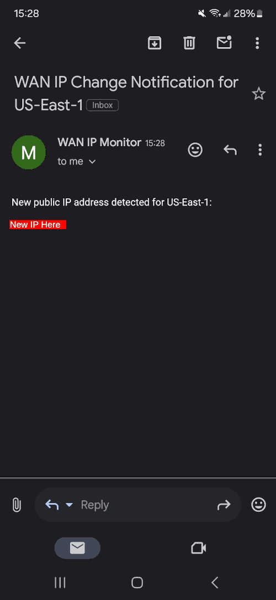

# wan-ip-monitor

A tool for homelabbers to act as a "half-measure" for dynamic DNS. It will check your WAN IP address and email you if it changes.

## Setup

* Set all of the environment variables
* Run the docker image locally, or
* Run the docker compose stack (recommended).

## Notes

* You can mount `/ip.txt` somewhere to use it outside of this program. The IP is printed to this file in plain text without a trailing newline.

## Example

